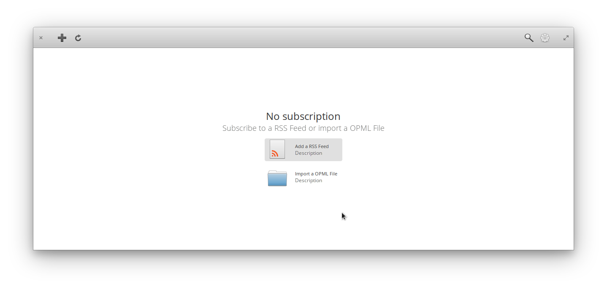

Reader is a RSS Feed Reader
===========================

Designed to be a modern alternative to liferea or similiar desktop feedreaders.
Together with the new HeaderBar design from GNOME and simplicity in mind i
created this application for my own needs. Eventually i will implement online
synchronization but for the moment i am only a offlineuser and therefore
i have no need for that. It follows partly elementary HIG and GNOME HIG (they
are similiar but not identical).

If anyone want to contribute i am happy to get in contact with you.

Btw i search for a nice name for that application (Reader is boring)
